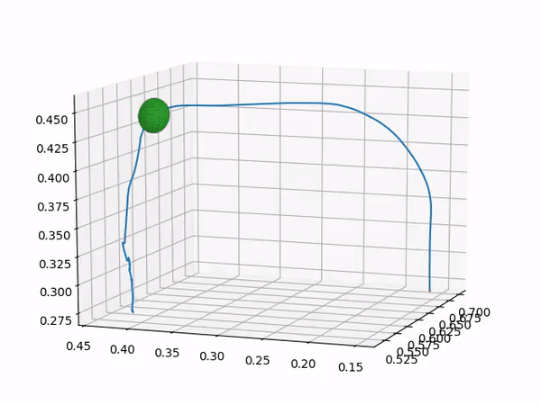
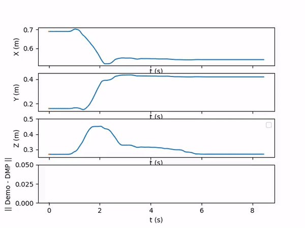
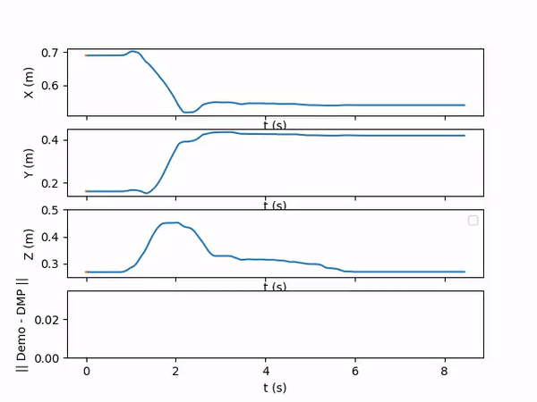

All the gifs shown below have a demostrated position for the end-effector marked with blue and the DMP generated path is marked with orange.

### Online obstacle avoidance with original parameters

### Online obstacle avoidance with updated parameters

### Online obstacle avoidance with updated parameters and attractor potential field

