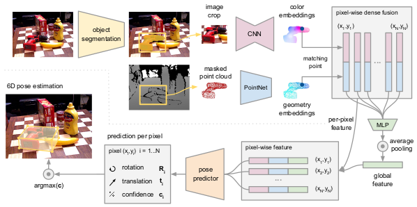
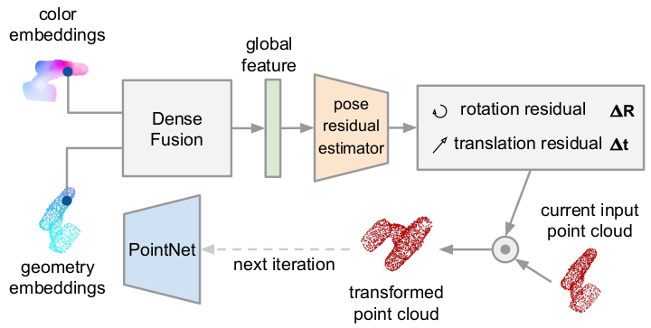
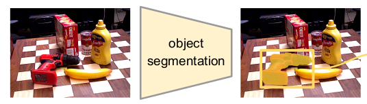
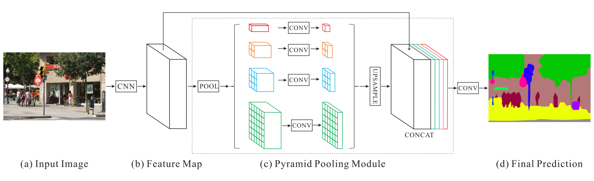
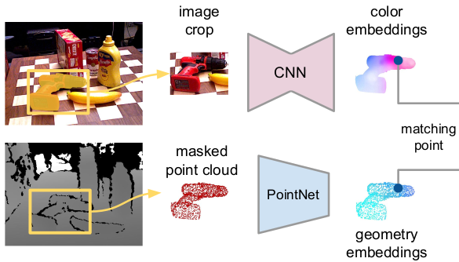
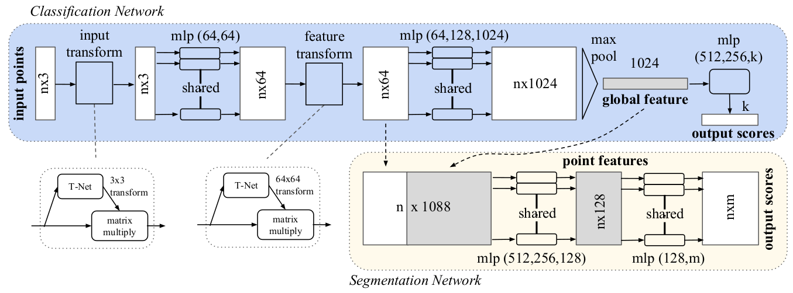

# Architecture Overview of DenseFusion

The image below shows the overview of DenseFusion.

DenseFusion first generates object segmentation masks and bounding boxes from RGB images. The RGB colors and point cloud from the depth map are encoded into embeddings and fused at each corresponding pixel. The pose predictor produces a pose estimate for each pixel and the predictions are voted to generate the final 6D pose prediction of the object. The iterative procedure of the approach is not depicted here for simplicity.

**DenseFusion contains two main stages:**

- The first stage takes color image as input and performs semantic segmentation for each known object category. The segmented object is combined with the masked depth pixels as well as an image path cropped by the bounding box of the mast to the second stage.
- The second stage processes the results of the segmentation and estimate the objects 6D pose. This stage consist of four components:
    1) A fully convolutional network that processes the color information and maps each pixel in the image crop to a color feature embedding
    2) A PointNet-based network processes each point in the masked 3D point cloud to a geometric feature embedding.
    3) A pixel-wise fusion network that combines both embedding and outputs the estimation of the 6D pose of the object based on an unsupervised confidence scoring.
    4) An iterative self-refinement methodology to train the network in a curriculum learning manner and refine the estimation result iteratively.

The figure above illustrates the first stage and 1), 2) and 3) from the second stage and the figure below illustrates 4) from the second stage.

# Semantic Segmentation

From the overview figure above the semantic segmentation part is shown below.

The image below illustrates the [Pyramid Scene Parsing Network](https://hszhao.github.io/projects/pspnet/index.html).

# Dense Feature Extraction

From the overview figure above the dense feature extraction part is shown below.

Even though color and depth present a similar format in RGB-D frame, their information resides in different spaces. Therefore, they are processed seperately to generate color and geometric features from embedding spaces that retain the intrinsic structure of the data sources.

**Dense 3D point cloud feature embedding:**

The segmented depth pixels are convereted into a 3D point cloud using the known camera intrinsics, and then a PointNet-like architecture is used to extract geometric features. The implemented PointNet-line architecture uses average-pooling, as opposed to the commonly used max-pooling, as the symmetric reduction function.

The PointNet architecture can be seen below.

The classification network takes *n* point as input, applies input and feature transformations, and the aggegates point feature by max-pooling (average-pooling in DenseFusion). The output is classification score for *k* classes. The segmentation network is an extension to the classification net. It concatenates global and local features and outputs per point scores. "mlp" stand for multi-layer-perceptron, number in bracket are layer sizes. Batchnorm is used for all layers wiht ReLU. Dropout layers are used for the last mlp in classification net.

**Dense color image feature embedding:**

The goal of the color embedding network is to extract per-pixel features such that the dense correspondences between 3D point features and image features can be formed. The image embedding network is a CNN-based encoder-decoder architecture that maps an image of size (*H x W x 3*) into a (*H x W x d_rgb*) embedding space. Each pixel of the embedding is a d_rgb-dimensional vector representing the appearance information of the input image at the corresponding location. 

# Pixel-wise Dense Fusion

# 6D Object Pose Estimation

# Iterative Refinement